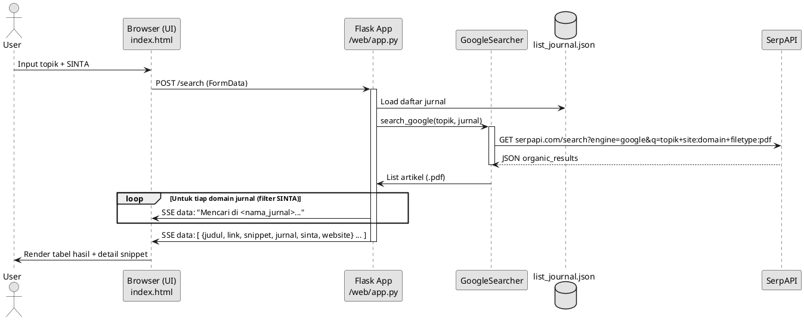
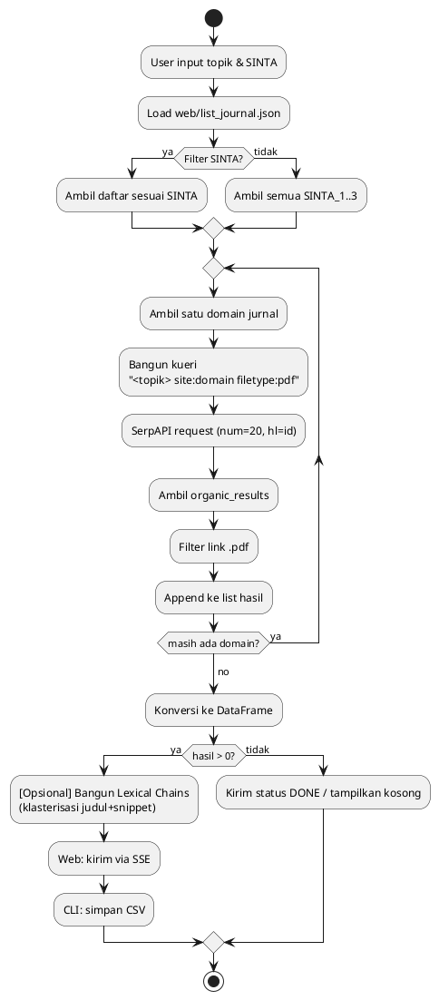

# Dokumentasi Pengembangan Aplikasi Pencarian PDF Jurnal Indonesia

Dokumen ini mendeskripsikan metode penelitian, arsitektur dan cara kerja aplikasi, diagram PlantUML (sequence dan flowchart), rancangan implementasi lexical chain, serta hasil implementasi dan pembahasannya berbasis berkas-berkas berikut:

- `web/list_journal.json`
- `web/app.py`
- `web/templates/index.html`
- `journal_scraper.ipynb`
- `hasil_pdf_google_machine_learning_20250501_173928.csv`

---

## 1. Metode Penelitian

- __Jenis__: Studi kepustakaan berbantuan mesin pencari (Google) melalui SerpAPI, dengan pembatas domain jurnal Indonesia berakreditasi SINTA.
- __Populasi/Sampel__: Daftar jurnal SINTA 1–3 pada `web/list_journal.json`. Pencarian terarah menggunakan kueri: `"<topik> site:<domain_jurnal> filetype:pdf"`.
- __Instrumen__:
  - API: SerpAPI endpoint `https://serpapi.com/search` dengan parameter utama: `engine=google`, `q=<kueri>`, `hl=id`, `num=20`, `api_key=<kunci>`.
  - Filter hasil: hanya URL yang berakhiran `.pdf`.
- __Prosedur__:
  1. Ambil daftar domain jurnal dari `web/list_journal.json` (kelompok SINTA_1–SINTA_3).
  2. Untuk tiap domain, panggil SerpAPI memakai pola kueri di atas.
  3. Kumpulkan hasil organik, saring link `.pdf`, simpan atribut: judul, link, snippet, nama jurnal, peringkat SINTA, website jurnal.
  4. Hasil dikompilasi ke `pandas.DataFrame` untuk ditampilkan (web) atau disimpan ke CSV (CLI).
- __Etika dan Validasi__:
  - Status akreditasi dan URL dapat berubah; verifikasi di SINTA (catatan ada di `web/list_journal.json`).
  - Gunakan seperlunya dan patuhi kebijakan situs jurnal (robots/ToS). 
  - Kualitas data daftar jurnal memengaruhi hasil (misal salah ketik domain: `ejournal.undiksha.ac.idi`).
- __Keterbatasan__:
  - Hanya mendeteksi PDF dari ekstensi `.pdf` (bisa melewatkan PDF yang di-serve tanpa ekstensi).
  - `num=20` per situs per kueri—cakupan terbatas.
  - Ketergantungan pada SerpAPI (batas kuota/kunci API).

---

## 2. Arsitektur dan Cara Kerja Aplikasi

- __Backend__ (`web/app.py`):
  - `Flask` dengan route `GET /` untuk UI dan `POST /search` untuk streaming hasil dengan Server-Sent Events (SSE).
  - Kelas `GoogleSearcher` menyusun kueri `"<topik> site:<domain> filetype:pdf"` dan memanggil SerpAPI (library `requests`).
  - Membaca `list_journal.json`, memfilter berdasarkan input peringkat SINTA, mengagregasi hasil ke `pandas.DataFrame` dan mengirimkan ke klien via SSE.
- __Frontend__ (`web/templates/index.html`):
  - Form input topik dan filter SINTA, UI berbasis Tailwind CSS.
  - Konsumsi SSE: menampilkan log progres dan tabel hasil (judul, jurnal, SINTA, link PDF, detail snippet).
- __CLI Notebook__ (`journal_scraper.ipynb`):
  - Alur yang setara dengan web, interaktif di terminal. Menyimpan hasil ke CSV `hasil_pdf_google_<topik>_<timestamp>.csv` dan mencetak ringkasan.

> Catatan run: `web/app.py` mengakses `list_journal.json` dengan path relatif. Jalankan app dari direktori `web/` atau sesuaikan path agar file ditemukan.

---

## 3. Sequence Diagram (PlantUML)



---

## 4. Flowchart (PlantUML Activity)



---

## 5. Implementasi Lexical Chain (Rancangan)

Walau kode saat ini belum menerapkan lexical chain, berikut rancangan ringan yang dapat langsung diintegrasikan setelah hasil terkumpul dalam `DataFrame`.

- __Tujuan__: Mengelompokkan artikel berdasarkan kohesi leksikal (kemiripan istilah) agar pengguna melihat klaster topik terkait.
- __Fitur Teks__: gabungan `judul + snippet`.
- __Pra-proses__: lowercase, hapus tanda baca, stopwords (EN/ID), lemmatization (opsional: spaCy/NLTK, Sastrawi untuk ID).
- __Metode cepat (aproksimasi)__: TF-IDF + cosine similarity + komponen terhubung (graph) sebagai rantai leksikal.
- __Output__: `chain_id` per artikel + skor kohesi (rata-rata kemiripan intra-klaster).

Contoh implementasi Python (aproksimasi lexical chain, dapat ditempatkan di modul utilitas dan dipanggil dari `web/app.py` setelah `DataFrame` terbentuk):

```python
# pip install scikit-learn networkx nltk
import re
import math
import networkx as nx
import numpy as np
from sklearn.feature_extraction.text import TfidfVectorizer
from sklearn.metrics.pairwise import cosine_similarity

def simple_normalize(text: str) -> str:
    text = text or ""
    text = text.lower()
    text = re.sub(r"[^a-z0-9\s]", " ", text)
    return re.sub(r"\s+", " ", text).strip()

def build_lexical_chains(df, text_cols=("judul", "snippet"), sim_threshold=0.25):
    texts = (df[text_cols[0]].fillna("") + " " + df[text_cols[1]].fillna("")).apply(simple_normalize)
    vec = TfidfVectorizer(min_df=1, stop_words="english")  # ganti/extend dengan stopwords Indonesia bila perlu
    X = vec.fit_transform(texts)
    sim = cosine_similarity(X)

    # graph berbasis ambang kemiripan
    G = nx.Graph()
    G.add_nodes_from(range(len(df)))
    n = sim.shape[0]
    for i in range(n):
        for j in range(i+1, n):
            if sim[i, j] >= sim_threshold:
                G.add_edge(i, j, w=float(sim[i, j]))

    chains = list(nx.connected_components(G))
    # beri chain_id dan skor sederhana
    chain_id = {}
    chain_score = {}
    for cid, comp in enumerate(chains):
        comp = sorted(list(comp))
        chain_id.update({idx: cid for idx in comp})
        if len(comp) > 1:
            sub = sim[np.ix_(comp, comp)]
            score = (np.sum(sub) - np.trace(sub)) / (len(comp) * (len(comp) - 1))
        else:
            score = 0.0
        chain_score[cid] = float(score)

    df = df.copy()
    df["chain_id"] = [chain_id[i] for i in range(len(df))]
    df["chain_score"] = df["chain_id"].map(chain_score)
    return df
```

- __Integrasi di Web (`web/app.py`)__:
  - Setelah `df = pd.DataFrame(all_results)`, panggil `df = build_lexical_chains(df)` lalu sertakan `chain_id`/`chain_score` dalam payload SSE agar UI bisa mengelompokkan hasil per rantai.
- __Integrasi di UI (`web/templates/index.html`)__:
  - Kelompokkan tampilan per `chain_id` (accordion per klaster). Urutkan klaster menurun berdasarkan `chain_score`.

> Alternatif lebih semantik: gunakan embedding kalimat (mis. `sentence-transformers`) untuk kemiripan yang lebih robust dan WordNet/KB untuk rantai leksikal klasik (synonymy/hypernymy). Namun contoh di atas ringan dan tanpa dependensi berat.

---

## 6. Hasil Implementasi (Sampel) dan Pembahasan

Berdasarkan eksekusi contoh di `journal_scraper.ipynb` (topik: `machine learning`), dihasilkan CSV `hasil_pdf_google_machine_learning_20250501_173928.csv` dengan ringkasan:

- __Ringkasan kuantitatif__:
  - Total temuan: 10 PDF.
  - Peringkat SINTA: seluruhnya `SINTA_1`.
  - Distribusi jurnal (contoh): dominan dari `International Journal on Electrical Engineering and Informatics (IJEEI)`.
- __Contoh judul__:
  - "A Novel Deep Learning Approach of Convolutional Neural ..."
  - "Mental Stress Detection via Heart Rate Variability using ..."
  - "Cat Sounds Classification with Convolutional Neural Network"
- __Kualitas hasil__:
  - Filter `.pdf` efektif memastikan file langsung unduh/akses.
  - Konsentrasi pada satu domain menandakan kesesuaian topik dengan cakupan jurnal tersebut atau keterbatasan hasil `num=20` pada domain lain.
- __Implikasi Lexical Chain__ (bila diaktifkan):
  - Artikel diperkirakan membentuk klaster seperti: "Deep Learning & CNN", "Fault Diagnosis/GoogleNet/PNN", "Resampling & Performance".
  - Memudahkan navigasi topik dan pemilihan referensi utama per klaster.

__Pembahasan keterbatasan__:
- Potensi bias domain karena batas kueri/deteksi `.pdf`.
- Ketergantungan pada struktur hasil Google/SerpAPI (perubahan API/anti-bot dapat berdampak).
- Kunci API saat ini tertanam di kode (`web/app.py`, `journal_scraper.ipynb`) — sebaiknya diganti dengan variabel lingkungan dan mekanisme konfigurasi.

---

## 7. Rekomendasi Pengembangan Lanjutan

- Baca kunci API dari environment (`SERPAPI_API_KEY`) dan hilangkan hardcode.
- Validasi & normalisasi domain jurnal (`list_journal.json`), perbaiki typo.
- Paralelisasi pencarian per domain (antri/delay untuk etika/kuota).
- Dedup dan canonicalization URL.
- Cakupan SINTA diperluas (4–6) dengan konfigurasi.
- Integrasi penuh lexical chain di backend dan grouping di UI.
- Simpan metadata tambahan (tahun, penulis) bila tersedia.

---

## 8. Cara Menjalankan Singkat

- __Prasyarat__: Python 3.11+, `pip install flask requests pandas` (tambahan untuk lexical chain: `scikit-learn networkx nltk`).
- __Web App__:
  - Jalankan dari folder `web/`: `python app.py`.
  - Akses `http://localhost:5000`, masukkan topik dan (opsional) peringkat SINTA.
- __CLI__:
  - Jalankan `journal_scraper.ipynb` (atau ekspor ke `.py`) dan ikuti prompt. Hasil akan tersimpan ke CSV bertimestamp.

---

## 9. Referensi Berkas

- Konfigurasi jurnal: `web/list_journal.json`
- Backend: `web/app.py` (route `/` dan `/search`, kelas `GoogleSearcher`)
- Frontend: `web/templates/index.html`
- CLI: `journal_scraper.ipynb`
- Sampel hasil: `hasil_pdf_google_machine_learning_20250501_173928.csv`

---

Disusun: 17 Agustus 2025 (WIB)
